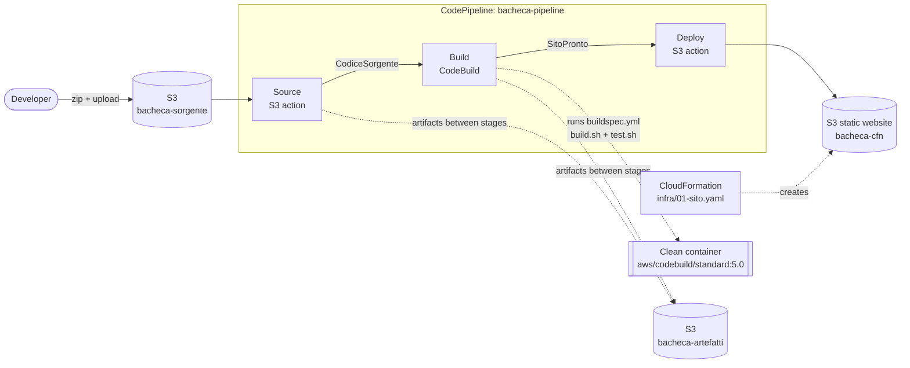

# AWS CI/CD Pipeline, Emulated Locally

A three-stage AWS pipeline — **Source → Build → Deploy** — built with **CodePipeline**, **CodeBuild**, **S3**, **CloudFormation** and **IAM**, running entirely on my laptop through the **LocalStack** emulator. No AWS account, no cost.

Built during the *AWS Cloud Architect* program at **ITS ICT Piemonte** (Unit 3: Automation & Pipelines with AWS).

> **What was provided vs. what I did.** The starter kit (scripts, templates and Italian-language instructions in `ISTRUZIONI.md`) was provided by the course. I ran the full lab end-to-end on my own machine, diagnosed the problems I hit along the way, and documented the results in [`deliverables/`](deliverables/).

---

## Architecture



- **CodePipeline** orchestrates only: it never runs commands itself, it hands artifacts from one service to the next.
- **CodeBuild** does the work in a fresh container: `build.sh` produces `dist/`, then `test.sh` runs six checks. Any check fails → non-zero exit code → build `FAILED` → no artifact.
- **CloudFormation** creates the website bucket from code, so the infrastructure is versioned and reproducible.
- **IAM** service role (`ruolo-pipeline`) defines what the pipeline and the build container are allowed to do.

---

## What I did

| Phase | Goal | Outcome |
|---|---|---|
| 1 | Publish a static site to S3 by hand with the AWS CLI | ✅ — and saw why manual steps don't scale |
| 2 | Declare the same bucket in CloudFormation, then change one line | ✅ — watched the changeset update only what changed |
| 3 | Build and test in an isolated CodeBuild container | ✅ `SUCCEEDED`; ❌ `FAILED` on purpose when a `TODO` was left in the site |
| 4 | Full CodePipeline: Source → Build → Deploy | ✅ Source and Build; ❌ Deploy blocked by an emulator bug (see below) |

The key result: when I pushed broken code (a leftover `TODO`), the pipeline **stopped at Build and the Deploy stage never started**. Broken code never got near the website.

| Run | Source | Build | Deploy |
|---|---|---|---|
| Clean code | ✅ Succeeded | ✅ Succeeded | ❌ Failed — LocalStack bug |
| Code with `TODO` | ✅ Succeeded | ❌ **Failed** | — never started |

Screenshots: [`deliverables/screenshots/`](deliverables/screenshots/)

---

## Problems I diagnosed

This is the part of the lab I learned the most from.

### 1. Out of disk in GitHub Codespaces
The build stage stalled in Codespaces. The cause: the official CodeBuild image (`aws/codebuild/standard:5.0`) takes **28 GB** on disk. I moved the whole lab to my own machine (Intel MacBook Pro, Docker Desktop), cleaned up ~28 GB of old Docker data first, and continued locally.

### 2. A build stuck in `IN_PROGRESS` forever
Docker showed the build container had finished successfully (`Exited (0)`), but CodeBuild still reported `IN_PROGRESS`. In the LocalStack logs I found the cause: 10 seconds after `StartBuild`, LocalStack checked on the container while the 7 GB image was still downloading, got `Container not yet started`, and its watcher thread crashed. The build ran, but nothing was left to record the result. Once the image was cached, a new build completed in ~20 seconds.

### 3. The S3 Deploy action fails inside LocalStack
Deploy failed on every run. Instead of stopping at "it didn't work", I pulled the error with `codepipeline get-pipeline-state`:

```
Invalid type for parameter Key, value: style.css,
type: <class 'pathlib._local.PosixPath'>, valid types: <class 'str'>
```

- I ruled out my own setup: the target bucket existed, created by CloudFormation one minute earlier.
- The message shows LocalStack's deploy code passing each file name to S3 `PutObject` as a Python path object instead of a string.
- I tested a workaround (`"Extract": "false"` with an explicit `ObjectKey`). LocalStack ignored the setting and failed the same way, confirming the bug is in the emulator, not the pipeline definition.

### 4. A credential committed to the repository
I found my LocalStack auth token committed in `.env.example`. I **rotated the token first** (removing it from the file alone would leave it readable in Git history), then replaced it with a placeholder and kept the real value in the git-ignored `.env`.

---

## What I learned

- **An emulator tests the flow, not the permissions.** LocalStack does not enforce IAM, so a pipeline can work perfectly here and fail in production for lack of permissions. Permissions must be tested on a real AWS account.
- **Know where your tools lie.** Besides the documented gaps, I found three undocumented differences from real AWS: the S3 deploy bug, the ignored `Extract` setting, and CodeBuild saving loose files instead of the configured `sito-pronto.zip`.
- **A pipeline exists to say no.** Its most important job isn't speed: it's stopping broken code before users see it.
- **Rotate first, clean up second** when a secret leaks.
- **Read the whole error.** Every problem above was solved from an error message or a log line, not by guessing.

---

## Run it yourself

**Prerequisites:** Docker Desktop, AWS CLI v2, `jq`, `zip`, `python3`, ~35 GB free disk, and a free [LocalStack](https://app.localstack.cloud) account (CodeBuild and CodePipeline need the student plan).

```bash
git clone https://github.com/wanjirungumo/its-aws-in-casa.git
cd its-aws-in-casa
cp .env.example .env              # then paste your own LocalStack token into .env
docker compose up -d              # start the AWS emulator
./scripts/00-check.sh             # checks tools and available services

./scripts/30-fase3-codebuild.sh   # Phase 3: CodeBuild on its own
./scripts/40-fase4-pipeline.sh    # Phase 4: create the pipeline (starts automatically)
./scripts/41-rilancia.sh          # re-run after changing sito/

./scripts/99-pulizia.sh && docker compose down -v   # clean up
```

The first build downloads a very large image and can take 10–30 minutes. Later builds take seconds.

---

## Tech

AWS CodePipeline · AWS CodeBuild · Amazon S3 · AWS CloudFormation · AWS IAM · LocalStack · Docker · AWS CLI · Bash

## Credits

Lab designed by the ITS ICT Piemonte *AWS Cloud Architect* program. Execution, troubleshooting and write-up by **Esther Wanjiru Ngumo**.
